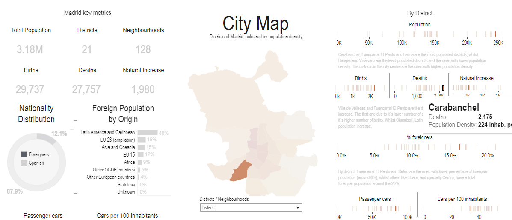
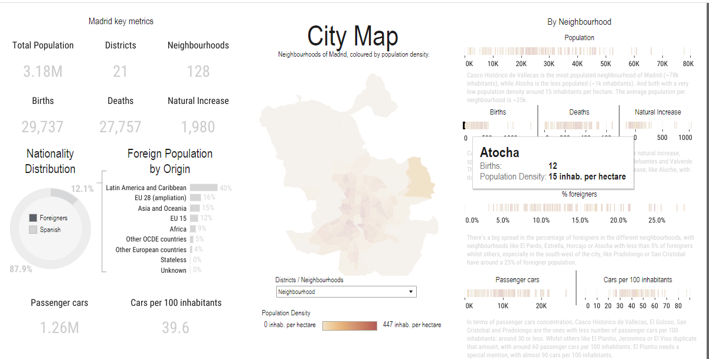
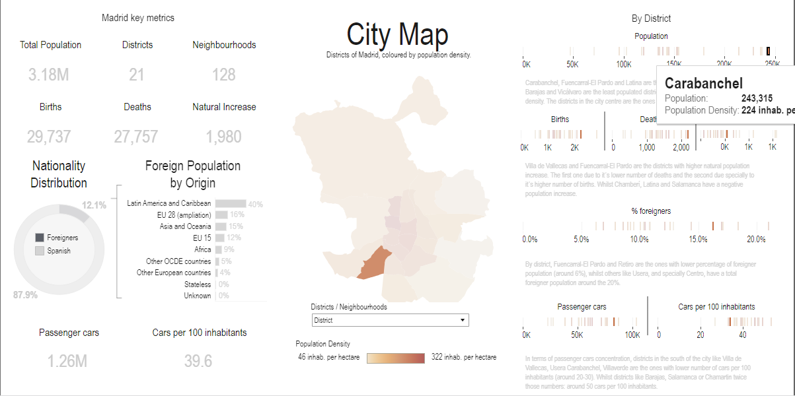

# Data Visualization Interpretation

## Project Overview

A significant aspect of working with data is the ability to interpret data visualizations and effectively communicate insights. In this project, I aim to enhance my data interpretation skills by exploring Tableau dashboards.

---

## Insight 1: Out of the 21 districts in Madrid, which district has the most deaths?

- **Static Image**: 
- **Explanation**: From the Madrid in Detail dashboard, navigate to the City Map dropdown selection to filter Madrid by District, which generates the graph to the right. From the “Deaths” panel, the district with the highest deaths was revealed to be “Carabanchel” with 2,175 deaths.

---

## Insight 2: Which neighborhood in Madrid has the least amount of births??

- **Static Image**: 
- **Explanation**: Utilizing the same dashboard, navigate to the City Map dropdown selection to filter Madrid by Neighborhood. By selecting from the “Births” panel, the neighborhood with the least number of births has been revealed to be “Atoche”, standing at 12 births.

---

## Insight 3: What percent of the most populated District are made up of foreigners?

- **Static Image**: 
- **Explanation**: By selecting “District” from the City Map dropdown, I am now able to choose the highest populated district from the “Population” panel located in the “District” graph. This shows that the most populated district in Madrid is “Carabanchel”. With a population of 243,315. Navigating to the “% foreigners” panel of the “District” graph reveals that the percentage of the population in “Carabanchel” is made up of 16.2% foreigners.

---

## Conclusion

In this project, my primary objective was to gain hands-on experience in interpreting and extracting insights from Tableau dashboards. I had the opportunity to explore various dashboards, selecting one of personal interest. From this chosen dashboard, I uncovered three significant insights, each substantiated by relevant static images. One crucial finding was the substantial foreign population in the "Carabanchel" district, accounting for 16.2% of its residents. This project not only enhanced my data interpretation skills but also emphasized the importance of conveying data-driven insights effectively.

---

**Project completed by Horatio Hanley**

**Date: 10/14/2023**
